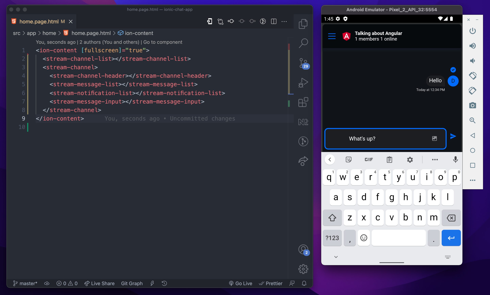

# Ionic Chat App using Stream Angular SDK

This is a demo application which uses Ionic and [Stream Angular SDK](https://staging.getstream.io/chat/docs/sdk/angular/) for building a Chat application that works on the web and on Android and iOS (using Capacitor)

You can check out [setting up an Ionic app with Capacitor](https://capacitorjs.com/docs/getting-started/with-ionic) and [The Angular SDK Tutorial](https://github.com/GetStream/stream-chat-angular/blob/master/tutorial/tutorial.md)

Here's how it looks on a Pixel 2 Android Emulator:



## Running the Android app

To run the Android app, note that you must have [Android Studio](https://developer.android.com/studio) installed with any [emulator](https://developer.android.com/studio/run/emulator?gclid=CjwKCAiA5t-OBhByEiwAhR-hmwEljX5xdBFusj6lmJlqydmDF37gOcjCDlsqi7nVTfn-QPINS6fmGxoCjl0QAvD_BwE&gclsrc=aw.ds) of your choice.

After cloning this repo, install the dependencies using `npm install`.

Create a file in `src/environments` called `environment.ts`, with the following structure:

```typescript
export const environment = {
  production: boolean,
  userId: string,
  apiKey: string,
  userToken: string,
}
```

For testing/development purposes, you can manually generate a token using [this token and authentication guide](https://getstream.io/chat/docs/react/tokens_and_authentication/#manually-generating-tokens) after signing into your Stream account.

Run a build of the codebase for web using `npm run build`.

The `www` directory generated after the build contains the distributed code for the web.

Add the android app using `npx cap add android`. This will generate the code for android using the code and assets in `www`.

Then open the project in Android Studio using `npx cap open android`

And on Android Studio, run the app using any emulator you want.

## Push notifications on Android

This branch contains an example on how to set up [push notifications v2](https://getstream.io/chat/docs/javascript/push_introduction/?language=javascript) to your application using Firebase.

Steps:

- [Configuring dashboard notifications on the Stream dashboard](https://getstream.io/chat/docs/sdk/android/client/guides/push-notifications/firebase/#configuring-notifications-on-the-stream-dashboard)
- This application uses the [`@capactior/push-notifications`](https://capacitorjs.com/docs/apis/push-notifications) plugin, you can follow [Capacitor's guide on how to set it up with Firebase](https://capacitorjs.com/docs/guides/push-notifications-firebase)
- This application uses [`@capactior/local-notifications`](https://capacitorjs.com/docs/apis/local-notifications) to display the received notification to the user
- the `src/app/home/home.page.ts` component includes the necessary set up (please note that our API won't deliver notifications if the user has an open WebSocket connection, so you have to disconnect when the app is paused, and reconnect when it's resumed)

Please note that our v2 push API uses data-only notifications and the `@capactitor/push-notification` plugin [won't deliver those if the application is killed](https://capacitorjs.com/docs/apis/push-notifications#silent-push-notifications-data-only-notifications).

<!-- ## Set Up Your Ionic Environment

To set up your environment, you will need [Node.js](https://nodejs.org/en/) and [Ionic CLI](https://ionicframework.com/docs/intro/cli) installed globally.

Create a new ionic application using the CLI:

```bash
ionic start
```

For the framework, choose Angular. Give your project a name, and choose a blank template.

### Install Dependencies

This app uses [Capacitor with Ionic](https://capacitorjs.com/docs/getting-started/with-ionic) as a native runtimne. So we need the following:

```bash
npm install @capacitor/app @capacitor/haptics @capacitor/keyboard @capacitor/status-bar
npm install @capacitor/android @capacitor/ios
```

The first line consists of plugins required for capacitor to work and for best user experience.

The second line consists of plugins required for our native environments. -->
